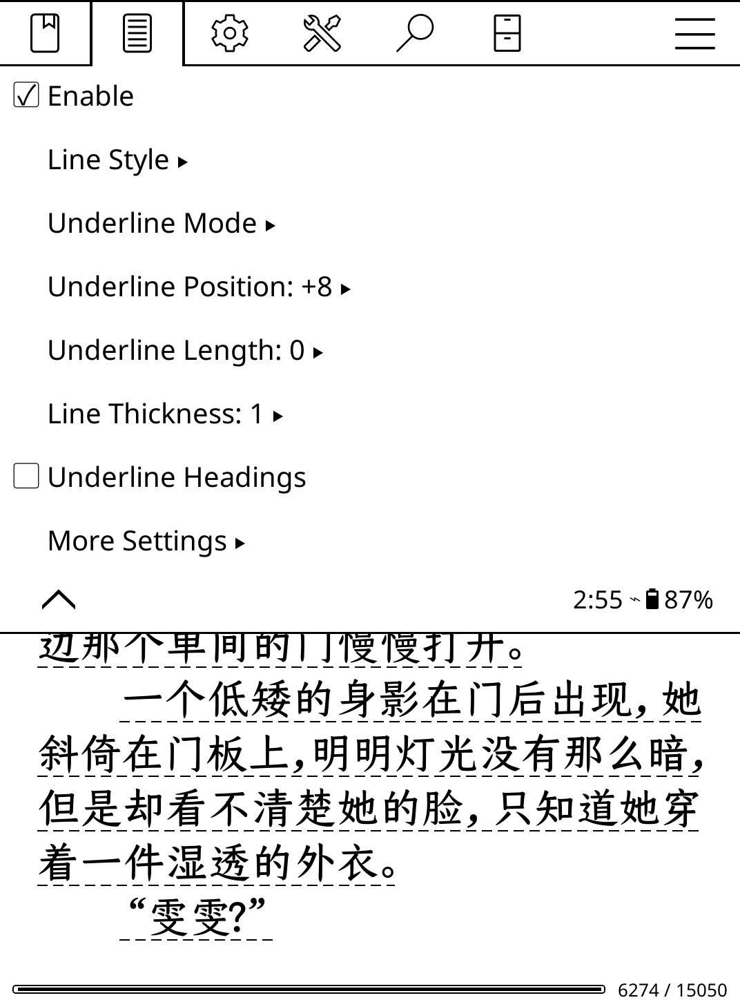
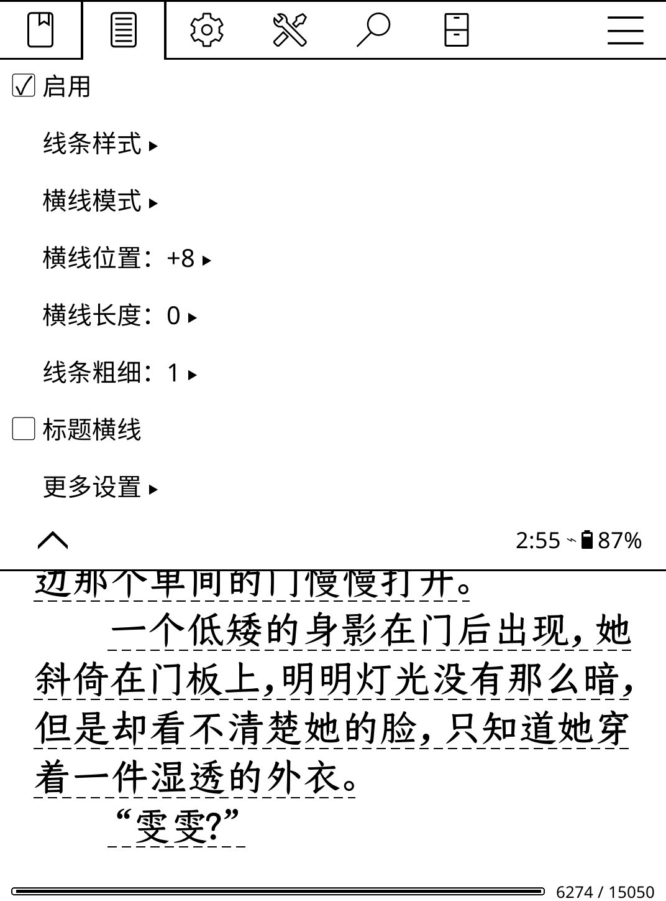

# KOReader 正文横线插件

**语言**

- 🇨🇳 简体中文（当前）
- 🇺🇸 [English](README.md)


正文横线（Full Text Underline）是一款 KOReader 阅读插件。

它可以在流式文档中为当前可见文字行绘制可调节横线，不修改书籍内容，也不会改变正文排版。


# 功能

- 单实线
- 单虚线
- 点线(粗细度需要设置到2以上)
- 整行横线模式
- 文字横线模式
- 横线纵向位置调节
- 横线长度调节
- 线条粗细调节
- 标题横线开关
- 当前书独立设置
- 插件默认设置
- KOReader 阅读配置（Profile）集成
- 简体中文和英文界面


# 截图


## 线条样式

| 实线 | 虚线 | 点线 |
|---|---|---|
|  |  |  |


## 文字跟随模式


## 界面

英文界面：




中文界面：




# 兼容性


已测试平台：

- Kindle
- Kobo
- Android KOReader


版本：

- 推荐：KOReader v2026.07.1 
- 已测试：KOReader v2026.07.1


较旧的 KOReader 版本可能不具备插件所需的 ReaderView 功能，因此可能无法显示横线。


插件面向 EPUB 等由 CRengine 排版的流式文档。

不适用于 PDF 等固定版式文档。


## 安装

1. 从 GitHub Releases 下载 `fulltextunderline-v1.0.0.zip`。
2. 解压 ZIP。
3. 将得到的 `fulltextunderline.koplugin` 整个目录复制到：

   ```text
   koreader/plugins/
   ```

4. 重启 KOReader。
5. 打开流式文档，在排版菜单中进入“正文横线”。

升级时请先退出 KOReader，再用新版本目录替换原插件目录。

## 使用说明

### 启用

控制当前书是否绘制正文横线。

### 线条样式

- **实线**：连续的横线。
- **虚线**：由清晰可辨的短线段组成。
- **点线**：均匀排列的点，并随粗细设置变化。

### 横线模式

- **整行横线**：每条检测到的视觉文字行都按正文区域完整宽度绘制。
- **文字横线**：横线跟随当前视觉行文字包围框的实际宽度。

### 横线位置

只移动最终绘制的横线，不移动文字，不改变行距，也不会触发重新分页。

### 横线长度

同时、对称地调节横线左右两端。保存范围为 `-20`～`+20`，0 保持原始横线范围。

### 线条粗细

支持 1～6 档，实线、虚线和点线共用同一粗细设置。

### 标题横线

标题默认不绘制横线。开启后，识别到的标题行也会按正文方式绘制。

### 当前书设置

菜单中进行的修改保存到当前书。一本书一旦拥有独立设置，以后修改插件默认值也不会覆盖它。

### 插件默认设置

在“更多设置”中选择“将当前设置设为默认”，以后第一次打开、尚无独立横线设置的新书会使用这套参数，已经配置过的书不受影响。

### 阅读配置

当 KOReader 阅读配置包含正文横线字段时，加载该配置会以最高优先级在运行时应用。Profile 参数不会自动写回当前书或插件默认设置。

## 配置优先级

```text
阅读配置（Profile）
        ↓
当前书独立设置
        ↓
插件默认设置
        ↓
插件内置默认值
```

界面翻译和内部配置值相互独立，切换 KOReader 界面语言不会改变或丢失已保存的横线设置。

## 多语言界面

源码使用英文原始字符串，简体中文翻译位于 `locale/zh_CN/`。KOReader v2026.07.1 不会自动扫描插件私有词典，因此插件通过 KOReader 自带的 `gettext.loadMO()` 加载翻译。未提供翻译的语言回退到英文。

## 使用限制

- 插件只在 ReaderView 当前缓冲区中绘制，不修改 EPUB，也不创建书籍标注。
- 不改变字号、行距、页边距、正文位置或分页。
- 当前面向 CRengine 流式文档。
- 横线位置依赖当前 KOReader 版本提供的文字屏幕框。

## 已知问题

- 部分很旧的 KOReader 版本缺少插件需要的 ReaderView 能力，可能无法显示横线。
- 不同设备字体和缩放比例会影响最舒适的横线位置与粗细，可以直接在插件菜单中调节。

## 卸载与回滚

退出 KOReader，删除 `koreader/plugins/fulltextunderline.koplugin`，然后重启。需要回滚时，将该目录替换为旧 Release 中的版本即可。插件不会修改书籍文件。

## 许可证

本项目采用 [GNU Affero General Public License v3.0](LICENSE)，与插件所集成的 KOReader API 许可证体系保持一致。

## 建议的 GitHub Topics

`koreader` · `koreader-plugin` · `kindle` · `kobo` · `ebook` · `lua` · `epub` · `reader`
